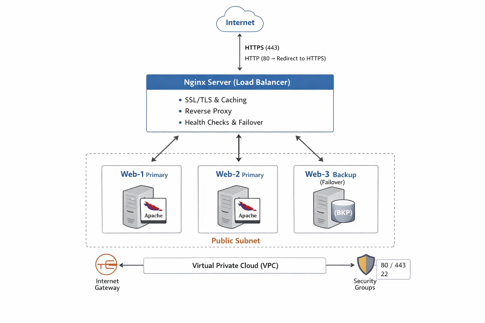

---

## Project Structure

```text
Assignment2/
├── README.md
├── main.tf
├── variables.tf
├── outputs.tf
├── locals.tf
├── terraform.tfvars.example
├── .gitignore
├── modules/
│   ├── networking/
│   │   ├── main.tf
│   │   ├── variables.tf
│   │   └── outputs.tf
│   ├── security/
│   │   ├── main.tf
│   │   ├── variables.tf
│   │   └── outputs.tf
│   └── webserver/
│       ├── main.tf
│       ├── variables.tf
│       └── outputs.tf
├── scripts/
│   ├── nginx-setup.sh
│   └── apache-setup.sh
├── screenshots/
│   ├── part1/
│   ├── part2/
│   ├── part3/
│   ├── part4/
│   ├── part5/
│   ├── part6/
│   └── bonus/
└── docs/
    ├── architecture.md
    └── troubleshooting.md

# Assignment 2 - Multi-Tier Web Infrastructure

## Project Overview
This project implements a secure, highly available multi-tier web infrastructure on AWS using Terraform.  
The setup includes:

- VPC, subnets, and route tables
- Nginx reverse proxy/load balancer
- Web servers with SSL/TLS
- Health checks and monitoring

---

## Architecture Diagram

---

## Components Description

- **Nginx Load Balancer:** Handles HTTPS/HTTP requests, caching, and reverse proxy.  
- **Web Servers:** Two primary web servers and one backup server for high availability.  
- **VPC & Networking:** Includes subnets, IGW, and routing for public access.  
- **Security Groups:** Controls inbound/outbound traffic for web and Nginx servers.

---

## Prerequisites

- Terraform installed  
- AWS CLI installed and configured  
- AWS credentials with necessary permissions  
- SSH key pair for EC2 access

---

## Deployment Instructions

1. Configure variables in `terraform_tfvars`  
2. Initialize Terraform:
terraform init

##Plan deployment:
terraform plan -var-file="terraform_tfvars"

##Apply deployment:
terraform apply -var-file="terraform_tfvars"

##Configuration Guide
Updating Backend IPs: Edit the main.tf in the webserver module.

Nginx Configuration: /etc/nginx/nginx.conf handles load balancing and SSL.

Testing: Access public IP in browser or use curl for health checks.

##Architecture Details
Network Topology: One VPC with public subnet hosting Nginx and web servers.

Security Groups: Allow HTTP/HTTPS traffic to Nginx, and SSH to EC2 instances.

Load Balancing Strategy: Round-robin across primary web servers, failover to backup.

##Troubleshooting
Common Issues: Terraform apply errors, missing AWS credentials, SSH access denied.

Log Locations:

Nginx: /var/log/nginx/

Web server logs: /var/log/

Debug Commands: terraform plan, terraform apply, terraform destroy
